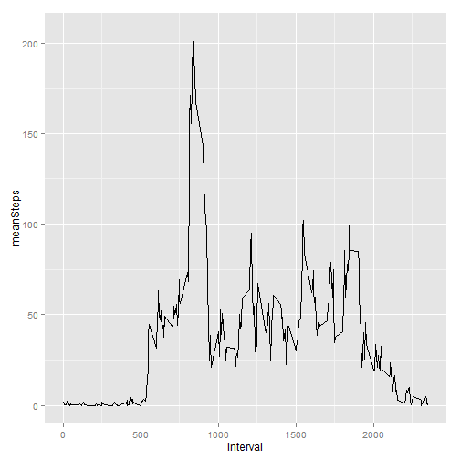

Peer Assessment 1
=================
  
  Peer assessment 1 assignment for Coursera course [Reproducible Research](Reproducible Research).


  
  Load packages.


```r
packages <- c("data.table", "ggplot2", "xtable", "VIM")
sapply(packages, require, character.only = TRUE, quietly = TRUE)
```

```
## Warning: package 'VIM' was built under R version 3.0.3
```

```
## VIM is ready to use.  Since version 4.0.0 the GUI is in its own package
## VIMGUI.
## 
## Please use the package to use the new (and old) GUI.
## 
## Attaching package: 'VIM'
## 
## The following object is masked from 'package:datasets':
## 
## sleep
```

```
## data.table    ggplot2     xtable        VIM 
##       TRUE       TRUE       TRUE       TRUE
```


> ### Loading and preprocessing the data
  > 
  > Show any code that is needed to
> 
  > 1. Load the data (i.e. `read.csv()`)
> 
  > 2. Process/transform the data (if necessary) into a format suitable for your analysis

Unzip the data file.


```r
executable <- file.path("C:", "Program Files (x86)", "7-Zip", "7z.exe")
parameters <- "x"
f <- file.path(getwd(), "activity.zip")
switch <- "-aoa"
cmd <- paste(paste0("\"", executable, "\""), parameters, paste0("\"", f, "\""), 
             switch)
cmd
```

```
## [1] "\"C:/Program Files (x86)/7-Zip/7z.exe\" x \"C:/Users/Ben/Documents/GitHub repositories/RepData_PeerAssessment1/activity.zip\" -aoa"
```

```r
system(cmd)
```


Read the CSV file.
Convert the data frame to a data table using the [`data.table`](http://cran.r-project.org/web/packages/data.table/index.html) package.


```r
dt <- read.csv(file.path(getwd(), "activity.csv"))
dt <- data.table(dt)
```


Verify that the number of rows in the dataset is the expected value of 17,568.


```r
check <- nrow(dt) == 17568
if (check == FALSE) stop("The number of rows in the dataset is not 17,568.")
```


Convert the `date` variable to a date class.
And look at the structure of the dataset.


```r
dt <- dt[, `:=`(date, as.Date(date))]
setkey(dt, date, interval)
str(dt)
```

```
## Classes 'data.table' and 'data.frame':	17568 obs. of  3 variables:
##  $ steps   : int  NA NA NA NA NA NA NA NA NA NA ...
##  $ date    : Date, format: "2012-10-01" "2012-10-01" ...
##  $ interval: int  0 5 10 15 20 25 30 35 40 45 ...
##  - attr(*, ".internal.selfref")=<externalptr> 
##  - attr(*, "sorted")= chr  "date" "interval"
```

```r
dt
```

```
##        steps       date interval
##     1:    NA 2012-10-01        0
##     2:    NA 2012-10-01        5
##     3:    NA 2012-10-01       10
##     4:    NA 2012-10-01       15
##     5:    NA 2012-10-01       20
##    ---                          
## 17564:    NA 2012-11-30     2335
## 17565:    NA 2012-11-30     2340
## 17566:    NA 2012-11-30     2345
## 17567:    NA 2012-11-30     2350
## 17568:    NA 2012-11-30     2355
```


> ### What is mean total number of steps taken per day?
  > 
  > For this part of the assignment, you can ignore the missing values in
> the dataset.
> 
  > 1. Make a histogram of the total number of steps taken each day
> 
  > 2. Calculate and report the **mean** and **median** total number of steps taken per day

Aggregate the number of steps taken each day.
Days with missing values (`NA`) will have `NA` when aggregated.


```r
dtDaily <- dt[, list(sumSteps = sum(steps)), date]
head(dtDaily)
```

```
##          date sumSteps
## 1: 2012-10-01       NA
## 2: 2012-10-02      126
## 3: 2012-10-03    11352
## 4: 2012-10-04    12116
## 5: 2012-10-05    13294
## 6: 2012-10-06    15420
```


Plot a histogram of the total number of steps taken each day.


```r
ggplot(dtDaily, aes(x = sumSteps)) + geom_histogram(alpha = 1/2, binwidth = 1000)
```

 


Calculate the mean and median total number of steps taken per day **before imputing**.


```r
tab <- dtDaily[, list(n = .N, nValid = sum(!is.na(sumSteps)), mean = mean(sumSteps, 
                                                                          na.rm = TRUE), median = median(sumSteps, na.rm = TRUE))]
print(xtable(tab), type = "html", include.rownames = FALSE)
```

<!-- html table generated in R 3.0.2 by xtable 1.7-1 package -->
  <TABLE border=1>
  <TR> <TH> n </TH> <TH> nValid </TH> <TH> mean </TH> <TH> median </TH>  </TR>
  <TR> <TD align="right">  61 </TD> <TD align="right">  53 </TD> <TD align="right"> 10766.19 </TD> <TD align="right"> 10765 </TD> </TR>
  </TABLE>
  
  
  Copy the data table `dtDaily` before imputation to be used later.


```r
dtDaily <- dtDaily[, `:=`(status, "Before imputation")]
dtDailyBeforeImputation <- dtDaily
```


> ### What is the average daily activity pattern?
  > 
  > 1. Make a time series plot (i.e. `type = "l"`) of the 5-minute interval (x-axis) and the average number of steps taken, averaged across all days (y-axis)
> 
  > 2. Which 5-minute interval, on average across all the days in the dataset, contains the maximum number of steps?

Aggregate the average number of steps taken by 5-minute interval.


```r
dtIntervals <- dt[, list(meanSteps = mean(steps, na.rm = TRUE)), interval]
```


Plot a time series of the 5-minute interval and the average number of steps taken across all days.


```r
ggplot(dtIntervals, aes(x = interval, y = meanSteps)) + geom_line()
```

 


> ### Imputing missing values
  > 
  > Note that there are a number of days/intervals where there are missing
> values (coded as `NA`). The presence of missing days may introduce
> bias into some calculations or summaries of the data.
> 
  > 1. Calculate and report the total number of missing values in the dataset (i.e. the total number of rows with `NA`s)
> 
  > 2. Devise a strategy for filling in all of the missing values in the dataset. The strategy does not need to be sophisticated. For example, you could use the mean/median for that day, or the mean for that 5-minute interval, etc.
> 
  > 3. Create a new dataset that is equal to the original dataset but with the missing data filled in.
> 
  > 4. Make a histogram of the total number of steps taken each day and Calculate and report the **mean** and **median** total number of steps taken per day. Do these values differ from the estimates from the first part of the assignment? What is the impact of imputing missing data on the estimates of the total daily number of steps?

Calculate the total number of missing values.


```r
dt <- dt[, `:=`(isStepsMissing, is.na(steps))]
tab <- dt[, .N, isStepsMissing]
print(xtable(tab), type = "html", include.rownames = FALSE)
```

<!-- html table generated in R 3.0.2 by xtable 1.7-1 package -->
  <TABLE border=1>
  <TR> <TH> isStepsMissing </TH> <TH> N </TH>  </TR>
  <TR> <TD> TRUE </TD> <TD align="right"> 2304 </TD> </TR>
  <TR> <TD> FALSE </TD> <TD align="right"> 15264 </TD> </TR>
  </TABLE>
  
  
  Use the [VIM](http://cran.r-project.org/web/packages/VIM/index.html) package to impute missing values of the `steps` variable.
Use k-Nearest Neighbour Imputation.


```r
dt <- kNN(dt)
```

```
## Time difference of -7.711 secs
```

```r
# dt <- irmi(dt)
```


The `kNN` function returns a dataset with all `NA`s replaced.
So the `steps` variable now contains imputed values replacing the `NA`s.

Verify that there are no missing values for `steps` after imputation.


```r
tab <- dt[, .N, list(isMissing = is.na(steps))]
print(xtable(tab), type = "html", include.rownames = FALSE)
```

<!-- html table generated in R 3.0.2 by xtable 1.7-1 package -->
<TABLE border=1>
<TR> <TH> isMissing </TH> <TH> N </TH>  </TR>
<TR> <TD> FALSE </TD> <TD align="right"> 17568 </TD> </TR>
</TABLE>


Verify that missingness is complete for an entire day.
Show all days with at least 1 missing value for the `steps` variable.
Calculate the proportion of records with missing values for each such day.
All proportions are 100%.


```r
dtMissingness <- dt[, list(countMissing = sum(isStepsMissing), countRecords = .N, 
propMissing = sum(isStepsMissing/.N)), date]
dtMissingness[countMissing > 0]
```

```
##          date countMissing countRecords propMissing
## 1: 2012-10-01          288          288           1
## 2: 2012-10-08          288          288           1
## 3: 2012-11-01          288          288           1
## 4: 2012-11-04          288          288           1
## 5: 2012-11-09          288          288           1
## 6: 2012-11-10          288          288           1
## 7: 2012-11-14          288          288           1
## 8: 2012-11-30          288          288           1
```


#### After imputation of missing values

Aggregate the number of steps taken each day.


```r
dtDaily <- dt[, list(sumSteps = sum(steps), isImputed = sum(steps_imp) > 0), 
date]
head(dtDaily)
```

```
##          date sumSteps isImputed
## 1: 2012-10-01     3036      TRUE
## 2: 2012-10-02      126     FALSE
## 3: 2012-10-03    11352     FALSE
## 4: 2012-10-04    12116     FALSE
## 5: 2012-10-05    13294     FALSE
## 6: 2012-10-06    15420     FALSE
```


Plot a histogram of the total number of steps taken each day **after imputing** and compare with the histogram **before imputing**.
Need to add an `isImputed` column to `dtDailyBeforeImputation` to make `rbind` work.


```r
dtDaily <- dtDaily[, `:=`(status, "After imputation")]
dtDailyBeforeImputation <- dtDailyBeforeImputation[, `:=`(isImputed, FALSE)]
dtDaily <- rbind(dtDaily, dtDailyBeforeImputation, use.names = TRUE)
ggplot(dtDaily, aes(x = sumSteps, fill = isImputed)) + geom_histogram(alpha = 1/2, 
binwidth = 1000) + facet_wrap(~status, nrow = 2) + theme(legend.position = "bottom")
```

 


Calculate the mean and median total number of steps taken per day **after imputing**.


```r
tab <- dtDaily[, list(n = .N, nValid = sum(!is.na(sumSteps)), mean = mean(sumSteps, 
na.rm = TRUE), median = median(sumSteps, na.rm = TRUE)), status]
print(xtable(tab), type = "html", include.rownames = FALSE)
```

<!-- html table generated in R 3.0.2 by xtable 1.7-1 package -->
<TABLE border=1>
<TR> <TH> status </TH> <TH> n </TH> <TH> nValid </TH> <TH> mean </TH> <TH> median </TH>  </TR>
<TR> <TD> After imputation </TD> <TD align="right">  61 </TD> <TD align="right">  61 </TD> <TD align="right"> 9752.39 </TD> <TD align="right"> 10395.00 </TD> </TR>
<TR> <TD> Before imputation </TD> <TD align="right">  61 </TD> <TD align="right">  53 </TD> <TD align="right"> 10766.19 </TD> <TD align="right"> 10765.00 </TD> </TR>
</TABLE>


The median of the imputed values is the same as the original values where missing values were not imputed.
However, the mean of the imputed values is **less than** the original values.
The overall impact of the imputed values is to **lower** the estimates of the number of steps taken each day.


> ### Are there differences in activity patterns between weekdays and weekends?
> 
> For this part the `weekdays()` function may be of some help here. Use
> the dataset with the filled-in missing values for this part.
> 
> 1. Create a new factor variable in the dataset with two levels -- "weekday" and "weekend" indicating whether a given date is a weekday or weekend day.
> 
> 1. Make a panel plot containing a time series plot (i.e. `type = "l"`) of the 5-minute interval (x-axis) and the average number of steps taken, averaged across all weekday days or weekend days (y-axis). The plot should look something like the following, which was creating using **simulated data**:
> 
>  
> 
> **Your plot will look different from the one above** because you will
> be using the activity monitor data. Note that the above plot was made
> using the lattice system but you can make the same version of the plot
> using any plotting system you choose.

Create a new factor variable in the dataset with two levels -- "weekday" and "weekend" indicating whether a given date is a weekday or weekend day.
Use this solution to [collapse the factor values](http://stackoverflow.com/a/9053619) for day of week.
Verify that `dayOfWeek` and `dayType` are factor class variables.


```r
levels <- c("Sunday", "Monday", "Tuesday", "Wednesday", "Thursday", "Friday", 
"Saturday")
newLevels <- c("Weekend", rep("Weekday", 5), "Weekend")
dt <- dt[, `:=`(dayOfWeek, factor(weekdays(date), levels = levels))]
dt <- dt[, `:=`(dayType, factor(newLevels[dayOfWeek]))]
dt[, .N, list(dayType, dayOfWeek)]
```

```
##    dayType dayOfWeek    N
## 1: Weekday    Monday 2592
## 2: Weekday   Tuesday 2592
## 3: Weekday Wednesday 2592
## 4: Weekday  Thursday 2592
## 5: Weekday    Friday 2592
## 6: Weekend  Saturday 2304
## 7: Weekend    Sunday 2304
```

```r
message(sprintf("Is dayOfWeek a factor? %s. Is dayType a factor? %s", is.factor(dt$dayOfWeek), 
is.factor(dt$dayType)))
```

```
## Is dayOfWeek a factor? TRUE. Is dayType a factor? TRUE
```


Aggregate the average number of steps taken by 5-minute interval.
Use the imputed values in the `steps` variable.


```r
dtIntervals <- dt[, list(meanSteps = mean(steps, na.rm = TRUE)), list(dayType, 
interval)]
```


Plot two time series (one for weekdays and the other for weekends) of the 5-minute intervals and average number of steps taken (imputed values).


```r
ggplot(dtIntervals, aes(x = interval, y = meanSteps, color = dayType)) + geom_line() + 
facet_wrap(~dayType, nrow = 2) + theme(legend.position = "none")
```

 


It's a bit hard to discern any differences.
So overlay the time series on a single plot instead of using a panel plot.


```r
ggplot(dtIntervals, aes(x = interval, y = meanSteps, color = dayType)) + geom_line() + 
  theme(legend.position = "bottom")
```

 
